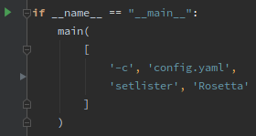

# notes

### debugging `beet` in PyCharm

* Install `beet` in ‘editable mode’: `pip install -e ./beets`

* Call  `beets/beets/ui/__init__.py` `main()` directly from a script

  * Don’t forget to use `config.yaml` explicitly

    * Point to the test library in the configuration file!

  * Otherwise it will default to `~/.config/beets/config.yaml` and the *actual* library, which is not desired

    

  * For some reason, nothing works when executing with ‘Run’…

