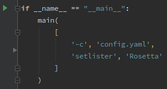

# notes

## debugging beet in PyCharm

* Install `beet` in ‘editable mode’: `pip install -e ./beets`

* Call  `beets/beets/ui/__init__.py` `main()` directly from a script

  * Don’t forget to use `config.yaml` explicitly

    * Point to the test library in the configuration file!

  * Otherwise it will default to `~/.config/beets/config.yaml` and the *actual* library, which is not desired

    

  * For some reason, nothing works when executing with ‘Run’…

## transliteration & MB pseudo-releases

* https://github.com/beetbox/beets/issues/1916
* https://github.com/beetbox/beets/issues/654

* MusicBrainz example of release+pseudo-release

* Many releases don’t have a pseudo-release however, so a fallabck option is needed
  * Direct transliteration: problematic for many languages ~ different readings

* Example
  * https://musicbrainz.org/release/13871087-8b69-4022-9bc9-4065e4243366 has no pseudo-release
  * However, there’s a link to https://vgmdb.net/album/74538, which contains English, Japanese and romaji tracklists. Artists are strictly in romaji though
    * [ ] How to get release info from this website?
      * https://github.com/elarkham/VGMdb-BeetsPlug
      * [There’s an API](https://vgmdb.info/)
    * [ ] Is VGMDB ‘common’ for Japanese releases without MB pseudo-releases? 
      * It’s video game-specific, so probably not really. Perhaps for anime, but not for ‘regular releases’
    * [ ] Are there other ‘common’ websites?
      * It wouldn’t be too weird if most releases list official sources instead (e.g. label or artist website)

## beets-link

